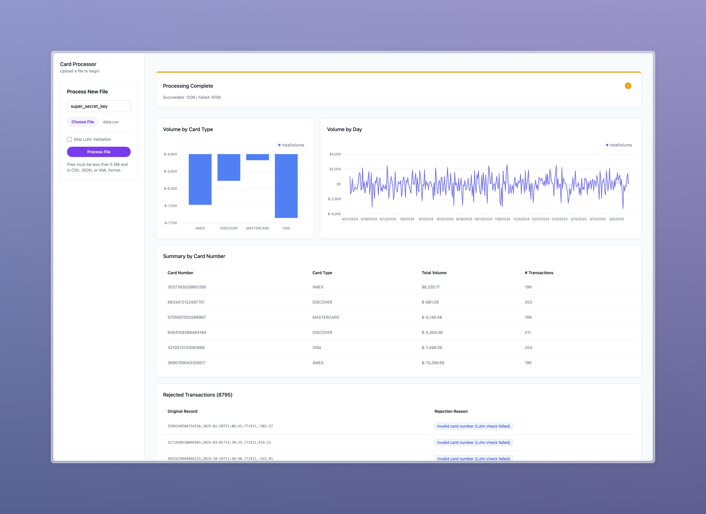

# Card Transaction Processor 
This project is a full-stack web application that processes credit card transaction files, persists the data, and displays summary reports on a web-based dashboard. It was built as a take-home assignment to demonstrate skills in modern web development, including backend architecture, frontend UI/UX, and testing.



## Tech Stack
- **Backend**: Node.js, Express, TypeScript
- **Database**: SQLite with Prisma ORM
- **Frontend**: React (with Vite), TypeScript
- **UI Library**: Tremor
- **State Management**: Zustand
- **Testing**: Jest & Supertest (Backend), Vitest & React Testing Library (Frontend)

## Getting Started
Follow these instructions to get the project running locally for development and testing.

### Prerequisites
- Node.js (v20 or later recommended)
- npm

### Server Setup
1. **Navigate to the server directory:**

```
cd server
```

2. **Install dependencies:**

```
npm install
```

3. **Create an environment file:** Create a `.env` file in the `server` directory and add the following variables. This file should not be committed to version control.

```
# The path to your SQLite database file
DATABASE_URL="file:./dev.db"

# A secret key for protecting API endpoints
API_SECRET_KEY="your-super-secret-api-key-here"
```

4. **Run database migrations:** This will create the `dev.db` database file and the necessary tables.

```
npx prisma migrate dev
```

5. **Start the development server:**

```
npm run dev
```

The server will be running on `http://localhost:5001`.

### Client Setup
1. **Open a new terminal window** and navigate to the client directory:

```
cd client
```

2. **Install dependencies:**

```
npm install
```

3. **Create an environment file:** Create a `.env.local` file in the `client` directory. Vite requires variables to be prefixed with `VITE_` to expose them to the application. Use the same key you defined in the server's `.env` file.

```
VITE_API_KEY="your-super-secret-api-key-here"
```

4. **Start the development server:**

```
npm run dev
```

The client will be running on **http://localhost:5173** and will open automatically in your browser.

## Architectural Decisions & Tradeoffs

1. **API Endpoint Idempotency**
- **Decision:** The primary `POST /api/process-transactions` endpoint was designed to be idempotent. Before inserting new records from an uploaded file, the server first deletes all existing transaction data from the database.
- **Justification:** This ensures that the application state always reflects the last processed file, providing a consistent and predictable user experience. It prevents duplicate records and incorrect reports that could arise from uploading the same file multiple times under an "append-only" model. This is a key principle in building reliable APIs.

2. **Frontend State Management (Zustand)**
- **Decision:** The lightweight global state manager Zustand was chosen to handle the frontend state.
- **Justification:** Zustand provides the power of a centralized global store without the heavy boilerplate associated with libraries like Redux. Its simple, hook-based API makes components cleaner and state logic easier to follow and test, which is ideal for a fast-moving project.

3. **Backend:** Node.js, Express & Prisma ORM
- Decision: A custom Node.js/Express server was chosen over a Backend-as-a-Service (BaaS) like Supabase.
- **Justification:** While a BaaS is excellent for rapid prototyping, the assignment specifically asks for a "server component with appropriate business logic." Building the server from scratch better demonstrates an understanding of backend architecture, API design, and clean separation of concerns (Routes, Controllers, Services).
- **Persistence:** SQLite was chosen as the database for its simplicity and file-based nature, which eliminates the need for a separate database server and makes the project easy for a reviewer to set up. Prisma was chosen as the ORM for its excellent type safety and developer experience.

4. **Frontend: File Uploader vs. Direct File System Access**
- **Decision:** The application uses a web-based file uploader instead of having the server read directly from the /data directory specified in the prompt.
- **Justification:** This was a deliberate design tradeoff. Building a file uploader creates a more interactive, realistic, and secure web application, which better showcases frontend development skills. The core parsing and validation logic in the service layer remains independent and could easily be re-purposed to read from a local directory if the requirements were to change.

5. **UI: Tremor Component Library**
- **Decision:** The Tremor library was selected for the frontend UI.
- **Justification:** The core of the UI requirement is a "reporting view." Tremor is a library specifically designed for building dashboards and analytics interfaces. Choosing a purpose-built tool allowed for the rapid development of a professional, cohesive, and visually appealing dashboard, demonstrating good judgment in selecting the right tool for the job.

## Assumptions & Known Limitations
- **Single File Processing:** The UI is designed to process one file at a time. The results of a new file upload will overwrite the previous results. The application does not currently support aggregating data from multiple separate uploads.

- **No User Authentication:** The application does not have a user login system. It uses a simple secret API key to protect the API endpoints, which is appropriate for its scope.

- **Luhn Validation Toggle:** The UI includes a checkbox to "Skip Luhn Validation." This provides flexibility for testing with malformed data but should be disabled in a production environment.

- **File Size Limit:** There is a hardcoded 5MB limit for uploaded files. This is a stability and security measure to prevent denial-of-service attacks from excessively large files.